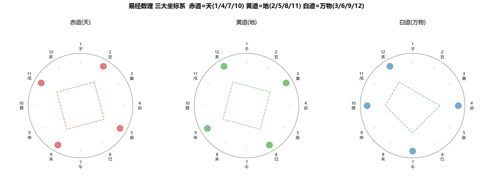

# ☯ 易经数理秘笈 · 太乙九宫天象拓扑解构系统
### *Yijing Mathematics & Taiyi Celestial Topology Open Source Project*

<p align="center">
  
</p>

<p align="center">
  <strong>基于梁致堂先生原著《易经数理秘笈》深度复原 · 纯粹数理逻辑 · 3D浑天天象拓扑 · 太乙八十一宫三向联动矩阵</strong>
</p>

<p align="center">
  
  
  
  
  
</p>

---

## 📖 项目背景与愿景

《易经》位列群经之首、大道之源。当代学者梁致堂先生在《易经数理秘笈》一书中，历经数十年数理考证与天文溯源，首次揭示了《周易》卦爻辞、太乙九宫与河图洛书背后蕴含的**严密天文数理算法与空间几何秩序**。

本项目旨在利用现代 Web 3D 图形学（Three.js）与现代纯数理算法引擎，对《易经数理秘笈》全书的理论体系进行**100% 数字化、可视化、交互化重构**。系统打破了传统易学停留在文字义理与模糊象征的局限，将《周易》还原为一套精密的**天体空间立体几何坐标算法**。

---

## 🌌 核心数理模型与拓扑架构

```
                                    ┌───────────────────────────────────────┐
                                    │    宇宙本源总气数 (任意自然数 N)      │
                                    └──────────────────┬────────────────────┘
                                                       │
                       ┌───────────────────────────────┴───────────────────────────────┐
                       ▼                                                               ▼
        ┌─────────────────────────────┐                                 ┌─────────────────────────────┐
        │   太乙 81 降维 (N mod 81)   │                                 │   地支 12 归属 (N mod 12)   │
        └──────────────┬──────────────┘                                 └──────────────┬──────────────┘
                       │                                                               │
                       ▼                                                               ▼
        ┌─────────────────────────────┐                                 ┌─────────────────────────────┐
        │  太乙九宫八十一宫阵图 (宫_位)│                                 │ 3D 浑天仪三大坐标系 (天/地/人)│
        │  (坎一宫 至 离九宫微观九格) │                                 │ 赤道(0°) 黄道(+23.5°) 白道(-15°)│
        └──────────────┬──────────────┘                                 └──────────────┬──────────────┘
                       │                                                               │
                       └───────────────────────────────┬───────────────────────────────┘
                                                       │
                                                       ▼
                                        ┌─────────────────────────────┐
                                        │  众和极数终极归九 (数位累加) │
                                        │      Digital Root = 9       │
                                        └─────────────────────────────┘
```

### 1. 三大天体坐标系 (3D Armillary Celestial Spheres)
- 🔴 **赤道系统 (天 / 0° 平面)**：对应地支余数 `1 (子)、4 (卯)、7 (午)、10 (酉)`，主干为天道阳仪运转；
- 🟢 **黄道系统 (地 / +23.5° 倾角)**：对应地支余数 `2 (丑)、5 (辰)、8 (未)、11 (戌)`，主干为大地四季承载；
- 🔵 **白道系统 (万物·月道 / -15° 倾角)**：对应地支余数 `3 (寅)、6 (巳)、9 (申)、12 (亥)`，主干为月球潮汐与万物生化。

### 2. 太乙八十一宫阵图 (Taiyi 81 Palace Matrix)
- 宏观严格遵循**洛书九宫**空间排布（戴九履一，左三右七，二四为肩，六八为足，五十居中）；
- 微观每一宫内含 9 个精确定准的气数，共计 81 宫位；
- 每一个单元格均带有原书权威角标位号 `(宫_位)`，如 `31 (四₄)`（巽四宫四位）、`16 (七₂)`（兑七宫二位）、`1 (一₁)`（坎一宫一位）。

### 3. 三向精准动态联动与弹性震荡微交互
- **左栏 3D 浑天天象坐标仪** (28%)、**中栏太乙 81 宫阵图** (36%)、**右栏控制台与解构大表** (36%) 达成 100% 毫秒级三向双向同步联动；
- 点击任意表格行或单元格，触发特调的 **`rowBounceShake` (0.45s 弹簧质感侧向震荡晃动)** 与辉金高亮，并支持 **【再点取消选中】(Toggle Off)**。

---

## 🏛️ 十一大系统解构馆全景导览

本项目由 11 个功能完备、各有侧重的专业 Web 应用馆组成：

| 序号 | 页面文件 | 系统模块 | 核心功能与数理内涵 |
| :---: | :--- | :--- | :--- |
| **01** | [`index.html`](index.html) | 🏠 **首页总览与天象拓扑总枢** | 全站 10 大门户卡片、3D 浑天仪宏观巡礼、太乙 81 宫全景概览。 |
| **02** | [`pipeline.html`](pipeline.html) | ⚡ **任意数据 12 步拆解推演流水线** | 输入任意正整数（如 `70000`），实时自动执行 5 步降维推演、5 步动画递算流程、N×k (1~12) 映射明细表。 |
| **03** | [`hexagrams.html`](hexagrams.html) | ☰ **64卦拓扑与爻辞六爻解构馆** | 64 卦全量下拉切选、上卦/下卦/错卦/综卦/互卦推导、初爻至上爻六爻 5 栏直列网格对齐、单爻点击爻辞联动与取消机制。 |
| **04** | [`laws.html`](laws.html) | ✨ **天象五大定律解构馆** | ① 10^n 太阳赤道守恒律；② 数 7 白道七星芒行律 (7×k 12芒星跳跃明细表)；③ 360° 切割归九律；④ 地支三合局；⑤ 永静数 6 巳亥天地门。 |
| **05** | [`wuxing.html`](wuxing.html) | ☯ **五行三元生克馆** | 水一、火二、木三、金四、土五原图书理生成数，相生相克 3D 几何流光闭环与三元映射。 |
| **06** | [`jiugong_qi.html`](jiugong_qi.html) | 📜 **九宫七输入通用推演解构馆** | 7 行通用参数任意输入、推演树点击启动/结束循环 (Toggle Off)、5 步动画递算卡片、整行解构定位大表。 |
| **07** | [`zhoutian360.html`](zhoutian360.html) | 🌀 **原书九宫纪周天(360°) 9x9 大表解构馆** | 还原原书 P315-320 巨型大表（一宫+90° 至 九宫+810°），9x9 倍积气数大表单格精准点击、三向联动与空间扩展。 |
| **08** | [`qishu939697.html`](qishu939697.html) | 🔢 **939697 七数律解构馆** | 揭秘原书 939697 七数律脉冲，展示数 3、6、9、7 乘积在赤/黄/白三道的跳跃轨迹。 |
| **09** | [`coordinates12.html`](coordinates12.html) | 🌌 **12方位与 3 坐标系解构馆** | 12 地支全方位三维坐标分解，按赤道、黄道、白道系统过滤与立体空间投影。 |
| **10** | [`ju81.html`](ju81.html) | 📐 **用矩 81 矩阵解构馆** | 原书 1~12 矩天际行数总表、巳亥四方位质变轴、324“承受天德之筐”扣节滑动演算器、“圆出于方”多边形拟合器。 |
| **11** | [`jiugong_tables.html`](jiugong_tables.html) | 📊 **原书九宫纪气 9x9 大表全解馆** | 还原原书 P246-252 坎一宫至离九宫九张独立 9x9 气数大表，支持单格精度点击与整行/单格算式推导。 |

---

## 🛠️ 技术栈与架构亮点

- **前端核心**：纯原生 JavaScript (ES6+)、HTML5 语义化结构、现代 CSS3 (Grid & Flexbox 布局)；
- **3D 可视化引擎**：[Three.js (r128)](https://threejs.org/) + OrbitControls 控制器；
- **渲染性能**：无第三方重型框架（如 React/Vue）编译开销，首屏 100% 毫秒级秒开，极低 CPU/GPU 内存占用；
- **算法层**：纯数学模运算函数集（`mod 81`、`mod 12`、`mod 9`、`Digital Root`、三元三角函数投影）；
- **响应式设计**：精心调校的黄金三栏比例（左 28% | 中 36% | 右 36%），高对比度深色玄学宇宙质感 UI。

---

## 🚀 快速开始与本地运行

由于本项目采用纯原生 Web 标准构建，**无需安装任何 Node.js 编译工具链即可直接运行**！

### 选项 1：直接双击打开
克隆仓库后，直接在浏览器中双击打开任意 `.html` 文件（如 `index.html`）即可体验完整功能。

### 选项 2：使用本地轻量 HTTP 服务器 (推荐)

#### 方法 A：使用 Node.js `npx http-server`
```bash
# 克隆仓库
git clone https://github.com/mytopop/yijing.git
cd yijing

# 启动本地静态服务器 (端口 8080)
npx http-server . -p 8080 -c-1
```
然后在浏览器访问：`http://localhost:8080`

#### 方法 B：使用 Python 内置服务器
```bash
# Python 3
python -m http.server 8080
```
然后在浏览器访问：`http://localhost:8080`

#### 方法 C：VS Code Live Server 插件
在 VS Code 中打开项目目录，右键 `index.html` 选择 **"Open with Live Server"**。

---

## 🐳 Docker / Nginx 部署指南

### 使用 Docker 一键运行
```bash
docker run -d --name yijing-web -p 8080:80 -v $(pwd):/usr/share/nginx/html:ro nginx:alpine
```
访问：`http://localhost:8080`

### Nginx 虚拟主机配置示例
```nginx
server {
    listen       80;
    server_name  yijing.yourdomain.com;

    location / {
        root   /var/www/yijing;
        index  index.html index.htm;
        try_files $uri $uri/ =404;
    }
}
```

---

## 📂 项目结构全览

```
yijing/
├── index.html            # 🏠 首页总览
├── home.js               # 首页交互逻辑
├── pipeline.html         # ⚡ 任意数据 12 步推演流水线
├── pipeline.js           # 流水线算法引擎
├── hexagrams.html        # ☰ 64 卦拓扑与六爻解构馆
├── hexagrams.js          # 64 卦数理与爻辞数据库
├── laws.html             # ✨ 天象五大定律解构馆
├── laws.js               # 五大定律算法引擎
├── wuxing.html           # ☯ 五行三元生克馆
├── wuxing.js             # 五行生克拓扑引擎
├── jiugong_qi.html       # 📜 九宫七输入通用推演解构馆
├── jiugong_qi.js         # 七输入推演树算法引擎
├── zhoutian360.html      # 🌀 周天 360° 9x9 大表解构馆
├── zhoutian360.js        # 周天大表算法引擎
├── qishu939697.html      # 🔢 939697 七数律解构馆
├── qishu939697.js        # 七数律算法引擎
├── coordinates12.html    # 🌌 12 方位 3 坐标解构馆
├── coordinates12.js      # 12 方位坐标算法
├── ju81.html             # 📐 用矩 81 矩阵解构馆
├── ju81.js               # 用矩法全景算法引擎
├── jiugong_tables.html   # 📊 九宫纪气 9x9 大表全解馆
├── jiugong_tables.js     # 坎一至离九 9x9 矩阵引擎
├── index.css             # 全局统一精美 CSS 样式与动画系统
├── 易经数理验算器.py      # Python 离线数理批量验算脚本
├── .gitignore            # Git 忽略配置
└── README.md             # 本项目开源说明文档
```

---

## 🤝 贡献与共建

热烈欢迎全球易学爱好者、天文学者、数学家与前端工程师共同参与共建：

1. **Fork** 本仓库；
2. 新建您的特性分支：`git checkout -b feature/AmazingFeature`；
3. 提交您的修改：`git commit -m 'Add some AmazingFeature'`；
4. 推送到分支：`git push origin feature/AmazingFeature`；
5. 开启一个 **Pull Request**。

---

## 📄 许可证 (License)

本项目采用 [MIT License](LICENSE) 开源协议。您可以自由地商用、修改、分发及复用本项目代码，但请保留原作者版权信息与致谢声明。

---

## 🙏 致谢与文献引用

- **理论源流**：梁致堂 著《易经数理秘笈》
- **古籍经典**：《周易》、《太乙金镜式经》、《洛书》、《河图》
- **图形库致谢**：[Three.js 团队](https://github.com/mrdoob/three.js/) 与广大开源社区贡献者

---

<p align="center">
  <sub>大道至简 · 数贯天地 · 象显周天</sub><br>
  <sub>Copyright © 2026 mytopop / Yijing Mathematics Contributors. All rights reserved.</sub>
</p>
