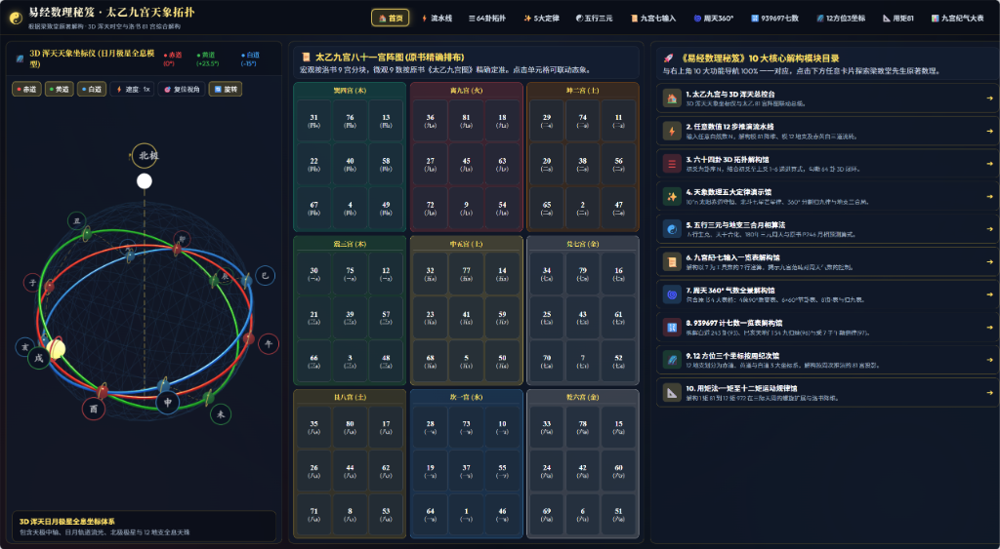

# 易经数理秘笈 · 太乙九宫天象拓扑解构系统
### Yijing Mathematics & Taiyi Celestial Topology Open Source System

<p align="center">
  
</p>

<p align="center">
  <strong>基于梁致堂先生原著《易经数理秘笈》深度复原 · 纯粹数理逻辑 · 3D 浑天天象拓扑 · 太乙八十一宫三向联动矩阵</strong>
</p>

<p align="center">
  
  
  
  
  
</p>

---

## 一、系统概述与学术缘起

《易经》位列群经之首、大道之源，数千年来多以义理、象数与占筮流传，其最底层的立体天文几何模型与代数算法长期湮没不彰。当代易学学者梁致堂先生历经数十载数理考证与浑天天象溯源，撰就《易经数理秘笈》，首次全面揭示了《周易》卦爻辞、太乙九宫与河图洛书背后蕴含的严密空间几何秩序与宇宙代数算法。

本项目致力于将梁致堂先生全书的学术精髓进行 100% 数字化、可视化与高交互性工程化重构。系统摒弃模糊臆测与玄学附会，严格遵循原著给出的数理逻辑与天体坐标体系，利用现代 Web 3D 图形技术（Three.js）与纯数学模运算引擎，完整还原了周天 360 度、太乙八十一宫、十二地支三大浑天坐标系以及任意自然数时空推演流水线。

---

## 二、系统六大核心特色

1. 【数理严谨，全量还原原著精髓】  
   严格依照梁致堂原著考证，深度实现太乙 81 宫九九大表、1 至 12 矩天际行数总表、周天 360 度纪气大表、九宫七输入通用推演树、天象五大数理定律以及 64 卦六爻拓扑，每一处算式推导皆有据可考。

2. 【零构建依赖，双击秒开体验】  
   全站基于纯原生 HTML5、CSS3 与现代原生 JavaScript (ES6+) 构建，无需安装 Node.js、Python、Webpack 或任何构建编译工具。克隆或下载项目后，直接双击根目录下的 index.html 即可在任意现代浏览器中瞬间启动。

3. 【3D 浑天立体天体拓扑引擎】  
   基于 Three.js 打造高精度浑天天球微宇宙系统，三维可视化解构赤道系统（天 / 0 度）、黄道系统（地 / +23.5 度倾角）与白道系统（万物月道 / -15 度倾角），并实时渲染地支天珠公转与粒子流动态。

4. 【毫秒级三向立体联动与微交互】  
   左栏 3D 浑天仪、中栏太乙八十一宫阵图、右栏控制解构大表实现毫秒级三向双向同步。支持单元格点击侧向弹性震荡高亮与再点取消（Toggle Off）机制，并配备智能矩度时空控制器，支持海量历史与未来年份瞬时跳跃定位。

5. 【全站阵图统一地支空间显化】  
   全站所有 11 个模块的太乙九宫阵图统一升级标定，单元格清晰显化权威位号与地支归属（如 四₄·子、七₂·辰、九₉·申），字体颜色与赤道（红）、黄道（绿）、白道（蓝）同构映射，兼备极高学术严谨度与视觉辨识度。

6. 【规范清晰的现代工业级架构】  
   项目完成全面模块化分层治理，彻底分离样式层（css/）、脚本引擎层（js/）、子功能页面层（pages/）、离线算力工具层（tools/）与文献资料库（docs/），根目录极简清爽，代码易读易扩展。

---

## 三、快速开始

### 运行方式（免安装 · 双击秒开）

本项目无需任何开发环境与服务端环境：

1. 克隆或下载本仓库至本地电脑：
   ```bash
   git clone https://github.com/mytopop/yijing.git
   ```

2. 打开项目根目录，直接双击 `index.html` 网页文件。

3. 即刻在任意现代浏览器（Chrome、Edge、Safari、Firefox 等）中秒开体验全部 11 大系统解构馆。

---

## 四、核心数理模型与拓扑架构

系统核心数理模型基于宇宙本源气数的层级降维映射机制，推演流水线与逻辑拓扑如下：

```
                               ┌───────────────────────────────────────────────┐
                               │       宇宙本源总气数 (任意自然数 N)           │
                               └──────────────────────┬────────────────────────┘
                                                      │
                       ┌──────────────────────────────┴──────────────────────────────┐
                       ▼                                                             ▼
        ┌─────────────────────────────┐                               ┌─────────────────────────────┐
        │   太乙 81 降维 (N mod 81)   │                               │   地支 12 归属 (N mod 12)   │
        └──────────────┬──────────────┘                               └──────────────┬──────────────┘
                       │                                                             │
                       ▼                                                             ▼
        ┌─────────────────────────────┐                               ┌─────────────────────────────┐
        │  太乙九宫八十一宫阵图 (宫_位)│                               │ 3D 浑天仪三大坐标系 (天/地/人)│
        │  (坎一宫 至 离九宫微观九格) │                               │ 赤道(0°) 黄道(+23.5°) 白道(-15°)│
        └──────────────┬──────────────┘                               └──────────────┬──────────────┘
                       │                                                             │
                       └──────────────────────────────┬──────────────────────────────┘
                                                      │
                                                      ▼
                                       ┌─────────────────────────────┐
                                       │  众和极数终极归九 (数位累加) │
                                       │      Digital Root = 9       │
                                       └─────────────────────────────┘
```

1. 【三大天体坐标系统 (3D Armillary Spheres)】
   - 赤道系统 (天道阳仪 / 0 度平面)：对应地支余数 `1 (子)、4 (卯)、7 (午)、10 (酉)`，表征天道刚健运转与赤道守恒律。
   - 黄道系统 (大地四季 / +23.5 度倾角)：对应地支余数 `2 (丑)、5 (辰)、8 (未)、11 (戌)`，表征大地四时承载与黄道节气演变。
   - 白道系统 (万物生化 / -15 度倾角)：对应地支余数 `3 (寅)、6 (巳)、9 (申)、12 (亥)`，表征月道潮汐、万物消长与天地交泰。

2. 【太乙八十一宫三元九运矩阵】
   宏观依照洛书九宫方位（戴九履一，左三右七，二四为肩，六八为足，五居中宫）严格分布，微观每宫统辖 9 个精确定准的气数位号，合为 81 宫。每一个单元格均标有精确的洛书宫位与地支坐标。

3. 【矩度时空推进体系】
   以 81 数为一个基本矩度（天德之筐），九矩为一小循环（729 数），十二矩为一天际大循环（972 数）。系统支持在任意大数（如公元纪年 2024 年）与微观基矩（1 至 81）之间精准切换映射。

---

## 五、十一大系统解构馆功能导览

系统由 11 个高保真专业 Web 模块组成，顶部导航栏与首页卡片支持全向直达：

| 序号 | 模块文件 | 模块名称 | 核心功能与数理内涵 |
| :---: | :--- | :--- | :--- |
| **01** | [`index.html`](index.html) | **首页总览与天象拓扑总枢** | 全站 10 大门户卡片直达、3D 浑天仪宏观巡礼、太乙 81 宫全景概览。 |
| **02** | [`pipeline.html`](pages/pipeline.html) | **任意数据 12 步推演流水线** | 输入任意正整数（如 `70000`），自动执行 5 步降维推演、5 步动画递算流程、N×k (1~12) 周天跳跃映射明细表。 |
| **03** | [`hexagrams.html`](pages/hexagrams.html) | **64卦拓扑与爻辞六爻解构馆** | 64 卦全量交互、初爻至上爻六爻 5 栏直列网格对齐、单爻点击爻辞联动与取消机制。 |
| **04** | [`laws.html`](pages/laws.html) | **天象五大定律解构馆** | 包含 10^n 太阳赤道守恒律、数 7 白道七星芒行律 (7×k 12芒星跳跃表)、360° 切割归九律、地支三合局与永静数 6 巳亥天地门。 |
| **05** | [`wuxing.html`](pages/wuxing.html) | **五行三元生克解构馆** | 地支三合、天干五合、五行生克、三元九运四模块平铺直达，支持大数年份（如九运 2024）跃迁定位第 25 矩并高亮显示。 |
| **06** | [`jiugong_qi.html`](pages/jiugong_qi.html) | **九宫七输入通用推演解构馆** | 7 行通用参数任意输入、推演树点击启动与结束循环 (Toggle Off)、5 步动画递算卡片、整行解构定位大表。 |
| **07** | [`zhoutian360.html`](pages/zhoutian360.html) | **原书周天 360° 9x9 大表馆** | 深度还原原书 P315 至 320 巨型大表（一宫+90° 至 九宫+810°），9x9 倍积气数大表单格精准点击、三向联动与空间扩展。 |
| **08** | [`qishu939697.html`](pages/qishu939697.html) | **939697 七数律解构馆** | 揭秘原书 939697 七数律脉冲，展示数 3、6、9、7 乘积在赤道、黄道、白道三系统的跳跃轨迹与周期响应。 |
| **09** | [`coordinates12.html`](pages/coordinates12.html) | **12方位与 3 坐标系解构馆** | 12 地支全方位三维坐标分解，按赤道、黄道、白道系统过滤与立体空间投影。 |
| **10** | [`ju81.html`](pages/ju81.html) | **用矩 81 矩阵解构馆** | 原书 1 至 12 矩天际行数总表、巳亥四方位质变轴、324 承受天德之筐扣节滑动演算器、圆出于方多边形拟合器。 |
| **11** | [`jiugong_tables.html`](pages/jiugong_tables.html) | **九宫纪气 9x9 大表全解馆** | 还原原书 P246 至 252 坎一宫至离九宫九张独立 9x9 气数大表，支持单格精度点击与整行单格算式推导。 |

---

## 六、项目工业级目录架构

项目已全面完成工程化治理，采用扁平且职责明确的分层体系：

```
yijing/
├── assets/               # 系统运行实景截图与原著底图资产
│   └── preview.png       # 首页高清实机全景预览图
│
├── css/                  # 全局样式系统
│   └── index.css         # 统一暗金科技感样式与微交互动效
│
├── js/                   # 核心算法引擎与交互逻辑 (独立解耦)
│   ├── home.js           # 首页交互与浑天仪总控
│   ├── pipeline.js       # 流水线降维算法引擎
│   ├── hexagrams.js      # 64 卦拓扑与爻辞数理库
│   ├── laws.js           # 天象五大定律算法引擎
│   ├── wuxing.js         # 五行生克与三元拓扑引擎
│   ├── jiugong_qi.js     # 七输入推演树算法引擎
│   ├── zhoutian360.js    # 周天 360° 大表算法引擎
│   ├── qishu939697.js    # 七数律脉冲算法引擎
│   ├── coordinates12.js  # 12 方位坐标转换算法
│   ├── ju81.js           # 用矩 81 矩阵算法引擎
│   └── jiugong_tables.js # 坎一至离九 9x9 矩阵引擎
│
├── pages/                # 十大子解构馆页面 (纯静态)
│   ├── pipeline.html     # 任意数据 12 步推演流水线
│   ├── hexagrams.html    # 64 卦拓扑与六爻解构馆
│   ├── laws.html         # 天象五大定律解构馆
│   ├── wuxing.html       # 五行三元生克馆
│   ├── jiugong_qi.html   # 九宫七输入通用推演解构馆
│   ├── zhoutian360.html  # 周天 360° 9x9 大表解构馆
│   ├── qishu939697.html  # 939697 七数律解构馆
│   ├── coordinates12.html# 12 方位 3 坐标解构馆
│   ├── ju81.html         # 用矩 81 矩阵解构馆
│   └── jiugong_tables.html# 九宫纪气 9x9 大表全解馆
│
├── tools/                # 离线批量验算脚本与自动化工具
│   ├── 易经数理验算器.py # Python 离线数理批量验算脚本
│   └── generate_9_palaces_tables.py # 九宫大表图片生成脚本
│
├── docs/                 # 原著文献资料库与深度研究归档
│   ├── papers/           # 英文论文与学术白皮书
│   ├── articles/         # 专题研究文集与公众号研讨汇编
│   ├── demos/            # 早期天象动力学实验原型
│   ├── book_source/      # 梁致堂原书扫描与 OCR 识别全文
│   └── book_charts/      # 原书插图、三大坐标系与数理拓扑底图
│
├── index.html            # 站点首页总枢 (双击直接秒开入口)
├── .gitattributes        # Git 属性配置文件
├── .gitignore            # Git 忽略配置
├── LICENSE               # MIT 开源许可证
└── README.md             # 本开源项目技术与说明文档
```

---

## 七、技术栈与工程实现

- 核心语言：原生 JavaScript (ES6+)、HTML5 语义化结构、现代 CSS3 (CSS Grid、Flexbox、GPU 加速微动画)。
- 图形引擎：Three.js (r128) 与 OrbitControls 轨道控制器，构建高保真三维立体浑天仪。
- 数学核心：纯粹数论与模运算算法引擎（余数模 81、模 12、模 9、数位归一累加 Digital Root、三元空间坐标投影）。
- 兼容性：兼容 Chrome、Microsoft Edge、Safari、Firefox 等所有支持 WebGL 与 ES6 的现代主流浏览器。

---

## 八、开源许可证 (License)

本项目采用 [MIT License](LICENSE) 开源许可证。您可以自由地商用、修改、分发及复用本项目代码，但请保留原作者版权信息与致谢声明。

---

## 九、致谢与经典文献

- 理论奠基：梁致堂 先生 著《易经数理秘笈》
- 典籍源流：《周易》、《太乙金镜式经》、《河图》、《洛书》
- 图形渲染致谢：[Three.js 团队](https://github.com/mrdoob/three.js/) 与开源 WebGL 社区贡献者

---

<p align="center">
  <sub>大道至简 · 数贯天地 · 象显周天</sub><br>
  <sub>Copyright (c) 2026 mytopop / Yijing Mathematics Contributors. All rights reserved.</sub>
</p>
